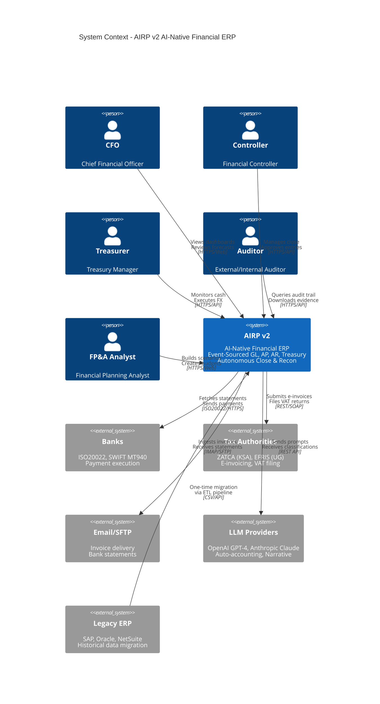
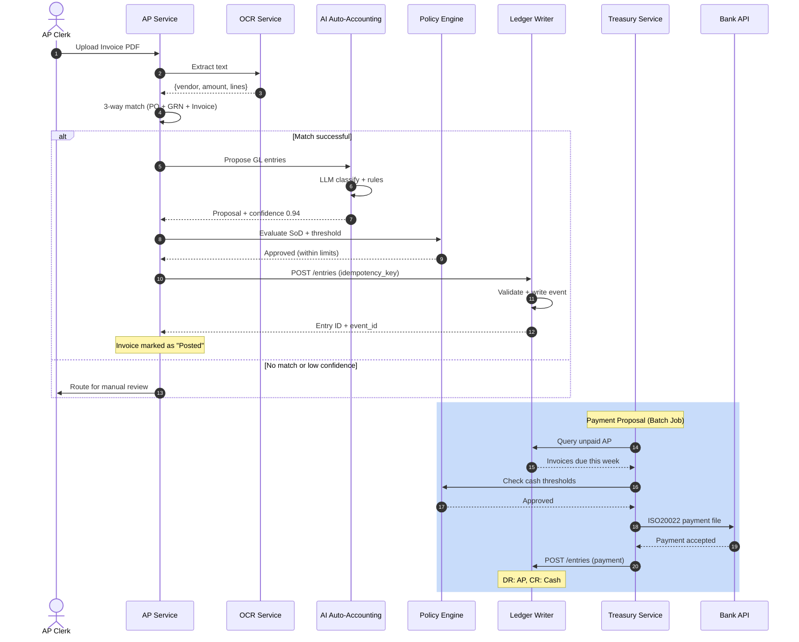
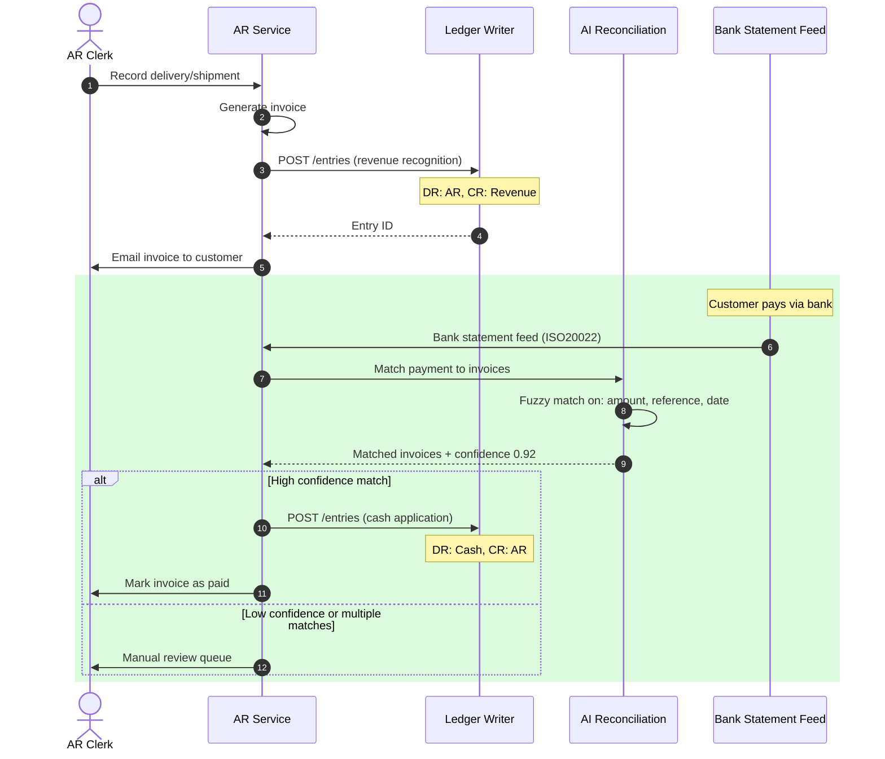
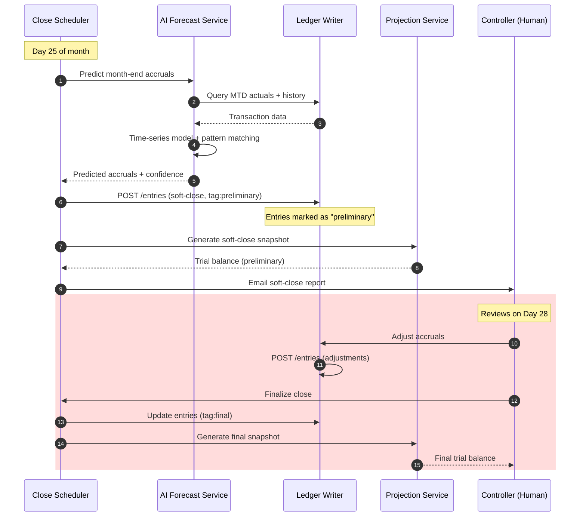
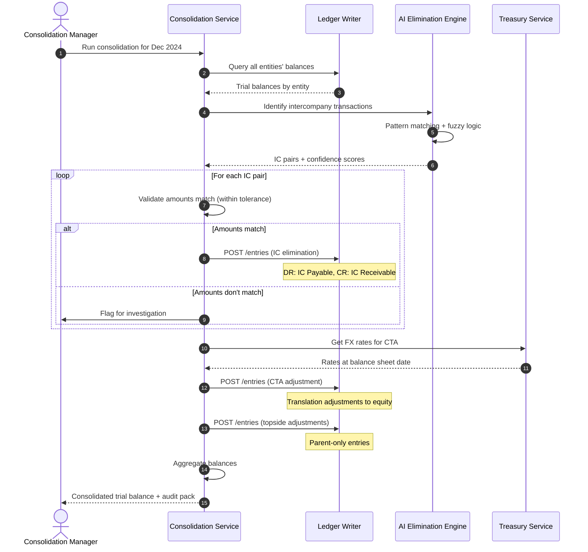
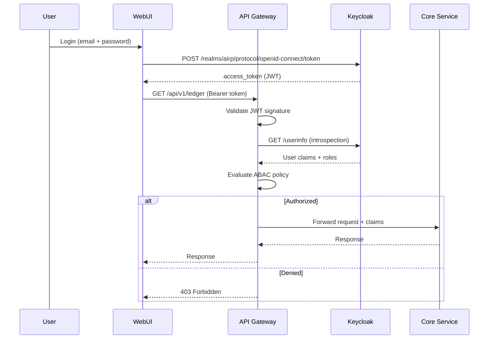

# AIRP v2 Architecture

**AI-Native Financial ERP - Technical Architecture**

Version: 2.0.0 | Last Updated: 2025-01-16

---

## Table of Contents

1. [System Context (C4 Level 1)](#system-context)
2. [Container Diagram (C4 Level 2)](#container-diagram)
3. [Component Diagram (C4 Level 3)](#component-diagram)
4. [Sequence Diagrams](#sequence-diagrams)
5. [Data Architecture](#data-architecture)
6. [Multi-Tenancy Strategy](#multi-tenancy)
7. [Event Sourcing Design](#event-sourcing)
8. [AI Explainability Flow](#ai-explainability)

---

## System Context (C4 Level 1)

### Diagram



### External Actors

| Actor | Interactions | Protocols |
|-------|-------------|-----------|
| **CFO** | Dashboards, financial reports, forecasts, board packs | Web UI, Email alerts |
| **Controller** | Journal approvals, close management, variance analysis | Web UI, API |
| **Treasurer** | Cash positions, FX deals, payment execution | Web UI, API |
| **Auditor** | Audit trail queries, evidence download, compliance reports | Read-only API |
| **FP&A Analyst** | Scenarios, budgets, driver-based models | Web UI, Excel add-in |

### External Systems

| System | Purpose | Integration Method |
|--------|---------|-------------------|
| **Banks** | Statement retrieval, payment execution | ISO20022 XML, SWIFT MT940, Bank APIs |
| **Tax Authorities** | E-invoicing submission, VAT filing | ZATCA REST API, EFRIS SOAP |
| **Email/SFTP** | Invoice ingestion, statement delivery | IMAP polling, SFTP scheduled pull |
| **LLM Providers** | Auto-accounting, narrative generation | OpenAI API, Anthropic API |
| **Legacy ERP** | Historical data migration | One-time ETL via CSV/API |

---

## Container Diagram (C4 Level 2)

### Diagram



```mermaid
C4Container
    title Container Diagram - AIRP v2 Microservices Architecture

    Person(user, "User", "CFO/Controller/Treasurer")

    Container_Boundary(frontend, "Frontend Layer") {
        Container(web_ui, "Web UI", "React/Next.js", "Dashboard, forms, reports")
        Container(mobile, "Mobile App", "React Native", "Approvals, quick views")
    }

    Container_Boundary(api_layer, "API Layer") {
        Container(api_gw, "API Gateway", "NestJS/Kong", "Routing, auth, rate limiting")
        Container(authz, "AuthZ Service", "Keycloak", "OIDC, RBAC/ABAC, SCIM")
    }

    Container_Boundary(core_services, "Core Financial Services") {
        Container(ledger_writer, "Ledger Writer", "TypeScript/NestJS", "Exactly-once event writes")
        Container(projection, "Projection Service", "TypeScript", "Materialized views (TB, aging)")
        Container(ap_svc, "AP Service", "TypeScript/NestJS", "Invoice matching, approvals")
        Container(ar_svc, "AR Service", "TypeScript/NestJS", "Invoicing, collections")
        Container(treasury_svc, "Treasury Service", "TypeScript/NestJS", "Cash, FX, hedging")
        Container(fpna_svc, "FP&A Service", "TypeScript/NestJS", "Scenarios, forecasts")
    }

    Container_Boundary(ai_services, "AI Services") {
        Container(ai_acct, "Auto-Accounting", "Python/FastAPI", "LLM GL code mapping")
        Container(ai_recon, "Reconciliation", "Python/FastAPI", "ML fuzzy matching")
        Container(ai_forecast, "Cash Forecast", "Python/FastAPI", "Time-series models")
        Container(ai_narrative, "Narrative Gen", "Python/FastAPI", "Report summaries")
        Container(ai_policy, "Policy Advisor", "Python/FastAPI", "RAG over IFRS/VAT")
    }

    Container_Boundary(data_layer, "Data Layer") {
        ContainerDb(event_store, "Event Store", "PostgreSQL", "Append-only events")
        ContainerDb(projection_db, "Projection DB", "PostgreSQL", "Read-optimized views")
        ContainerDb(vector_db, "Vector DB", "pgvector/Qdrant", "Policy embeddings")
        Container(cache, "Cache", "Redis", "Session, query cache")
    }

    Container_Boundary(messaging, "Messaging & Streaming") {
        Container(kafka, "Event Bus", "Kafka/Redpanda", "Domain events")
        Container(processor, "Stream Processor", "Kafka Streams", "Event transformations")
    }

    Container_Boundary(storage, "Storage & Search") {
        ContainerDb(object_store, "Object Storage", "MinIO/S3", "Documents, attachments")
        Container(search, "Search Engine", "Elasticsearch", "Audit log search")
    }

    Container_Boundary(ml_platform, "ML Platform") {
        Container(feature_store, "Feature Store", "Feast", "Feature engineering")
        Container(model_registry, "Model Registry", "MLflow", "Model versioning")
    }

    Container_Boundary(observability, "Observability") {
        Container(traces, "Tracing", "Tempo/Jaeger", "Distributed traces")
        Container(metrics, "Metrics", "Prometheus", "Time-series metrics")
        Container(logs, "Logging", "Loki", "Structured logs")
        Container(dashboards, "Dashboards", "Grafana", "Monitoring UI")
    }

    Rel(user, web_ui, "Uses", "HTTPS")
    Rel(web_ui, api_gw, "API calls", "REST/GraphQL")
    Rel(api_gw, authz, "Validates token", "OIDC")

    Rel(api_gw, ledger_writer, "POST /entries", "HTTP")
    Rel(api_gw, ap_svc, "Invoice CRUD", "HTTP")
    Rel(api_gw, ar_svc, "Invoice, receipt", "HTTP")

    Rel(ledger_writer, event_store, "Append event", "SQL")
    Rel(ledger_writer, kafka, "Publish event", "Kafka protocol")

    Rel(kafka, projection, "Subscribe", "Kafka consumer")
    Rel(projection, projection_db, "Update views", "SQL")

    Rel(ap_svc, ai_acct, "Propose GL codes", "HTTP")
    Rel(treasury_svc, ai_forecast, "Get 90d forecast", "HTTP")
    Rel(fpna_svc, ai_narrative, "Generate summary", "HTTP")

    Rel(ai_acct, vector_db, "Semantic search", "HTTP")
    Rel(ai_policy, vector_db, "RAG retrieval", "HTTP")

    Rel(ai_forecast, feature_store, "Get features", "HTTP")
    Rel(ai_forecast, model_registry, "Load model", "HTTP")

    Rel(ledger_writer, traces, "Send spans", "OTLP")
    Rel(ai_acct, metrics, "Increment counters", "Prometheus")

    UpdateLayoutConfig($c4ShapeInRow="4", $c4BoundaryInRow="2")
```

### Container Responsibilities

#### Frontend
- **Web UI**: React/Next.js SPA with responsive design, real-time updates via SSE
- **Mobile App**: React Native for approvals on-the-go

#### API Layer
- **API Gateway**: Request routing, authentication, rate limiting, API versioning
- **AuthZ Service**: Keycloak for OIDC/SAML, user management, RBAC/ABAC policies

#### Core Services
| Service | Purpose | Key Endpoints |
|---------|---------|---------------|
| **Ledger Writer** | Exactly-once event writes with outbox pattern | POST /events, GET /balance |
| **Projection Service** | Consumes events to build read models | Background processor |
| **AP Service** | 3-way matching, approvals, payment proposals | POST /invoices, POST /match |
| **AR Service** | Customer invoicing, cash application, dunning | POST /invoices, POST /receipts |
| **Treasury Service** | Cash positions, FX deals, hedge accounting | GET /positions, POST /fx-deals |
| **FP&A Service** | Scenario modeling, driver-based planning | POST /scenarios, GET /forecast |

#### AI Services
| Service | Model/Tech | Purpose |
|---------|-----------|---------|
| **Auto-Accounting** | GPT-4 + XGBoost | Classify transactions to GL/tax codes |
| **Reconciliation** | Fuzzy matching + DBSCAN | Match bank to ledger with confidence |
| **Cash Forecast** | Prophet + XGBoost | 90-day rolling forecast |
| **Narrative Gen** | Claude 3 | Generate executive summaries |
| **Policy Advisor** | RAG (OpenAI embeddings) | Answer IFRS/VAT questions |

#### Data Layer
- **Event Store**: PostgreSQL append-only table partitioned by month
- **Projection DB**: PostgreSQL with materialized views for trial balance, aging
- **Vector DB**: pgvector for policy embeddings (IFRS, VAT rules)
- **Cache**: Redis for user sessions, frequently accessed projections

---

## Component Diagram (C4 Level 3) - Posting Path

### Diagram



```mermaid
C4Component
    title Component Diagram - Invoice to Ledger Posting Path

    Container_Boundary(ap_service, "AP Service") {
        Component(invoice_api, "Invoice API", "NestJS Controller", "Receives invoice upload")
        Component(ocr_processor, "OCR Processor", "Tesseract/Azure CV", "Extracts text from PDF")
        Component(matcher, "3-Way Matcher", "Business Logic", "PO + GRN + Invoice")
        Component(approver, "Approval Engine", "Workflow", "Routes by threshold")
    }

    Container_Boundary(ai_accounting, "AI Auto-Accounting") {
        Component(llm_classifier, "LLM Classifier", "OpenAI GPT-4", "Maps to GL codes")
        Component(rules_engine, "Rules Engine", "Python", "Applies policy constraints")
        Component(confidence_scorer, "Confidence Scorer", "ML Model", "Returns score 0-1")
        Component(explainer, "Explainer", "LangChain", "Generates reasoning trace")
    }

    Container_Boundary(policy_engine, "Policy Engine") {
        Component(policy_eval, "Policy Evaluator", "OPA/Cedar", "Checks SoD, thresholds")
        Component(policy_store, "Policy Store", "PostgreSQL", "Stores Rego/Cedar")
    }

    Container_Boundary(ledger_service, "Ledger Writer") {
        Component(entry_validator, "Entry Validator", "Business Logic", "Checks balance, accounts")
        Component(idempotency, "Idempotency Guard", "Redis", "Deduplicates requests")
        Component(event_writer, "Event Writer", "SQL Transaction", "Writes to event_store")
        Component(outbox, "Outbox Publisher", "Transactional Outbox", "Publishes to Kafka")
    }

    ContainerDb(event_db, "Event Store", "PostgreSQL", "Immutable events")
    Container(kafka, "Kafka", "Event Bus", "Domain events")

    Container_Boundary(projection_service, "Projection Service") {
        Component(consumer, "Event Consumer", "Kafka Consumer", "Subscribes to events")
        Component(projector, "Projector", "SQL Updater", "Updates trial_balance view")
    }

    ContainerDb(projection_db, "Projection DB", "PostgreSQL", "Materialized views")

    Rel(invoice_api, ocr_processor, "Extract data", "Internal call")
    Rel(invoice_api, matcher, "Match PO/GRN", "Internal call")
    Rel(matcher, llm_classifier, "Propose entry", "HTTP POST")

    Rel(llm_classifier, rules_engine, "Apply constraints", "Python call")
    Rel(rules_engine, confidence_scorer, "Score proposal", "Python call")
    Rel(confidence_scorer, explainer, "Generate trace", "Python call")

    Rel(explainer, invoice_api, "Return proposal + trace", "HTTP response")
    Rel(invoice_api, approver, "Route for approval", "If confidence < 0.85")
    Rel(invoice_api, policy_eval, "Check policy", "HTTP")

    Rel(policy_eval, policy_store, "Load policies", "SQL")
    Rel(policy_eval, invoice_api, "Allow/Deny", "HTTP response")

    Rel(invoice_api, entry_validator, "Submit entry", "HTTP POST")
    Rel(entry_validator, idempotency, "Check request ID", "Redis GET")
    Rel(idempotency, entry_validator, "New/Duplicate", "Redis response")

    Rel(entry_validator, event_writer, "Write event", "Internal call")
    Rel(event_writer, event_db, "INSERT event", "SQL transaction")
    Rel(event_writer, outbox, "Write outbox", "Same SQL txn")

    Rel(outbox, kafka, "Publish event", "Async job")
    Rel(kafka, consumer, "Deliver event", "Consumer group")
    Rel(consumer, projector, "Project event", "Internal call")
    Rel(projector, projection_db, "UPDATE trial_balance", "SQL")

    UpdateLayoutConfig($c4ShapeInRow="3", $c4BoundaryInRow="1")
```

### Posting Path Flow

1. **Invoice Upload**: Controller receives PDF/image via multipart form
2. **OCR Extraction**: Tesseract/Azure extracts vendor, amount, line items
3. **3-Way Match**: Matches invoice to PO and GRN (if exists)
4. **AI Auto-Accounting**:
   - LLM proposes GL codes based on vendor history + line item descriptions
   - Rules engine applies policy constraints (e.g., capitalize if > AED 5000)
   - Confidence scorer returns 0-1 score
   - Explainer generates reasoning trace with citations
5. **Approval Routing**: If confidence >= 0.85, auto-approve; else route to controller
6. **Policy Check**: OPA evaluates SoD, threshold policies
7. **Entry Validation**: Checks debits = credits, valid accounts
8. **Idempotency Guard**: Redis check prevents duplicate writes
9. **Event Write**: Transactional write to event_store + outbox
10. **Event Publish**: Background job publishes to Kafka
11. **Projection Update**: Consumer updates trial_balance materialized view

---

## Sequence Diagrams

### 1. AP: Invoice to Payment



### 2. AR: Delivery to Cash Application



### 3. Continuous Close: Accrual Prediction



### 4. Consolidation: Intercompany Elimination



---

## Data Architecture

### Event Store Schema

```sql
-- Append-only event log (partitioned by month)
CREATE TABLE event_store (
    event_id          UUID PRIMARY KEY DEFAULT gen_random_uuid(),
    event_type        VARCHAR(100) NOT NULL, -- 'journal_entry.created'
    aggregate_id      UUID NOT NULL,         -- journal_entry.id
    aggregate_type    VARCHAR(50) NOT NULL,  -- 'journal_entry'
    payload           JSONB NOT NULL,        -- Full entry data
    metadata          JSONB,                 -- User, IP, confidence score
    entity_id         UUID NOT NULL,         -- Multi-tenant isolation
    occurred_at       TIMESTAMP NOT NULL DEFAULT now(),
    ingested_at       TIMESTAMP NOT NULL DEFAULT now(),

    -- Partitioning key
    partition_month   DATE GENERATED ALWAYS AS (DATE_TRUNC('month', occurred_at)) STORED
) PARTITION BY RANGE (partition_month);

-- Indexes
CREATE INDEX idx_event_aggregate ON event_store(aggregate_id, occurred_at);
CREATE INDEX idx_event_entity ON event_store(entity_id, occurred_at);
CREATE INDEX idx_event_type ON event_store(event_type, occurred_at);

-- Partitions (auto-managed by pg_partman)
CREATE TABLE event_store_2025_01 PARTITION OF event_store
    FOR VALUES FROM ('2025-01-01') TO ('2025-02-01');
```

### Projection Schema

```sql
-- Trial Balance (materialized view)
CREATE MATERIALIZED VIEW trial_balance AS
SELECT
    entity_id,
    account_id,
    account_code,
    account_name,
    account_type, -- ASSET, LIABILITY, EQUITY, REVENUE, EXPENSE
    currency,
    SUM(CASE WHEN entry_type = 'DEBIT' THEN amount ELSE 0 END) as debit,
    SUM(CASE WHEN entry_type = 'CREDIT' THEN amount ELSE 0 END) as credit,
    SUM(CASE WHEN entry_type = 'DEBIT' THEN amount ELSE -amount END) as balance,
    MAX(occurred_at) as as_of_date
FROM event_store
WHERE event_type = 'journal_entry.posted'
  AND jsonb_extract_path_text(payload, 'status') = 'posted'
GROUP BY entity_id, account_id, account_code, account_name, account_type, currency;

CREATE UNIQUE INDEX ON trial_balance(entity_id, account_id, currency);

-- Refresh strategy: incremental via trigger or scheduled job
```

---

## Multi-Tenancy Strategy

### Isolation Levels

| Level | Method | Use Case |
|-------|--------|----------|
| **Database** | Separate PostgreSQL instance per entity | Highly regulated entities, strict isolation |
| **Schema** | Separate schema per entity (entity_{id}) | Default for v2, balance of isolation & cost |
| **Row** | entity_id column + RLS policies | Shared services (e.g., tax rates, exchange rates) |

### Schema-Based Isolation (Default)

```sql
-- Create entity schema
CREATE SCHEMA entity_ae_parent;
CREATE SCHEMA entity_ae_sub1;

-- Clone structure
CREATE TABLE entity_ae_parent.journal_entry (LIKE public.journal_entry_template INCLUDING ALL);
CREATE TABLE entity_ae_parent.invoice (LIKE public.invoice_template INCLUDING ALL);

-- Row-level security (additional safety)
ALTER TABLE entity_ae_parent.journal_entry ENABLE ROW LEVEL SECURITY;

CREATE POLICY entity_isolation ON entity_ae_parent.journal_entry
    USING (entity_id = current_setting('app.current_entity_id')::UUID);
```

### Kafka Topic Strategy

```
airp.v2.{entity_id}.journal_entry.created
airp.v2.{entity_id}.invoice.posted
airp.v2.shared.fx_rate.updated  -- Shared topics for reference data
```

---

## Event Sourcing Design

### Event Types

```typescript
// Domain Events
interface JournalEntryCreated {
  event_type: 'journal_entry.created';
  aggregate_id: string; // journal_entry.id
  payload: {
    entity_id: string;
    book_id: string;
    entry_date: string; // ISO 8601
    description: string;
    lines: Array<{
      line_number: number;
      account_id: string;
      debit: number;
      credit: number;
      dimensions: Record<string, string>; // department, project, etc.
    }>;
    source: 'manual' | 'ai_proposed' | 'system_accrual';
    confidence_score?: number; // For AI-generated entries
    reasoning_trace?: string;   // Explainability
  };
  metadata: {
    user_id: string;
    ip_address: string;
    correlation_id: string;
  };
}

interface JournalEntryApproved {
  event_type: 'journal_entry.approved';
  aggregate_id: string;
  payload: {
    approved_by: string;
    approved_at: string;
    comments?: string;
  };
}

interface JournalEntryPosted {
  event_type: 'journal_entry.posted';
  aggregate_id: string;
  payload: {
    posted_at: string;
    posted_by: string;
  };
}
```

### Exactly-Once Semantics

```typescript
// Idempotency via Redis + Outbox Pattern
async function writeJournalEntry(entry: JournalEntry, idempotencyKey: string) {
  // 1. Check idempotency key
  const cached = await redis.get(`idempotency:${idempotencyKey}`);
  if (cached) {
    return JSON.parse(cached); // Return cached result
  }

  // 2. Start database transaction
  await db.transaction(async (trx) => {
    // 3. Write event to event_store
    const event = await trx('event_store').insert({
      event_type: 'journal_entry.created',
      aggregate_id: entry.id,
      payload: entry,
      entity_id: entry.entity_id,
    }).returning('*');

    // 4. Write to outbox (same transaction)
    await trx('outbox').insert({
      event_id: event[0].event_id,
      topic: `airp.v2.${entry.entity_id}.journal_entry.created`,
      payload: event[0].payload,
    });

    // 5. Cache result
    await redis.setex(`idempotency:${idempotencyKey}`, 3600, JSON.stringify(event[0]));

    return event[0];
  });
}

// Outbox publisher (separate job)
setInterval(async () => {
  const pending = await db('outbox').where('published_at', null).limit(100);

  for (const msg of pending) {
    await kafka.send({
      topic: msg.topic,
      messages: [{ key: msg.event_id, value: JSON.stringify(msg.payload) }],
    });

    await db('outbox').where('id', msg.id).update({ published_at: new Date() });
  }
}, 1000); // Poll every second
```

---

## AI Explainability Flow

### Decision Trace Format

```typescript
interface AIDecisionTrace {
  decision_id: string;
  service: 'auto_accounting' | 'reconciliation' | 'forecast' | 'narrative';
  model: string; // 'gpt-4-1106-preview', 'xgboost-v2.3'
  version: string; // Model version
  input: {
    transaction: any;
    context: any; // Historical data, rules
  };
  output: {
    classification: string; // '5100-COGS'
    confidence: number; // 0.94
    alternatives: Array<{
      classification: string;
      confidence: number;
      reasoning: string;
    }>;
  };
  reasoning: {
    primary_factors: string[]; // ["Vendor historical pattern", "PO line category"]
    policy_citations: string[]; // ["IFRS 15.31", "Company Policy 4.2"]
    retrieved_context: string[]; // RAG sources
    prompt_template: string;
    llm_raw_response: string;
  };
  human_override?: {
    overridden_by: string;
    overridden_at: string;
    new_classification: string;
    reason: string;
  };
  feedback_loop?: {
    correct: boolean; // Labeled by controller
    feedback_date: string;
  };
  timestamp: string;
  latency_ms: number;
}
```

### Example Trace

```json
{
  "decision_id": "dec_2025_01_16_xyz789",
  "service": "auto_accounting",
  "model": "gpt-4-1106-preview",
  "version": "2024-11-01",
  "input": {
    "transaction": {
      "vendor": "AWS",
      "amount": 4750.00,
      "description": "EC2 compute charges Dec 2024",
      "invoice_date": "2024-12-31"
    },
    "context": {
      "vendor_history": "Last 6 invoices coded to 6200-Cloud Services",
      "budget_line": "IT Infrastructure"
    }
  },
  "output": {
    "classification": "6200-Cloud Services",
    "confidence": 0.94,
    "alternatives": [
      {
        "classification": "6100-Software Licenses",
        "confidence": 0.04,
        "reasoning": "Less likely; AWS typically OpEx not SaaS license"
      },
      {
        "classification": "5100-COGS",
        "confidence": 0.02,
        "reasoning": "Possible if compute serves production, but budget indicates G&A"
      }
    ]
  },
  "reasoning": {
    "primary_factors": [
      "Vendor AWS matched to 6200 in 89% of historical invoices (n=47)",
      "Description 'EC2 compute' strongly correlates with Cloud Services category",
      "Budget owner confirmed IT Infrastructure allocation"
    ],
    "policy_citations": [
      "Company Policy 3.1: Cloud computing expenses classify as IT OpEx",
      "IFRS: Expensed unless meeting asset capitalization criteria (>12mo life, >AED 5000)"
    ],
    "retrieved_context": [
      "Vector search: 'cloud computing accounting' → Policy 3.1 (similarity: 0.91)",
      "Historical pattern: AWS → 6200 (89% frequency)"
    ],
    "prompt_template": "system: You are a financial accountant. Classify the transaction.\nuser: Vendor: {vendor}, Amount: {amount}, Description: {description}\nContext: {context}\n\nReturn JSON: {account_code, confidence, reasoning}",
    "llm_raw_response": "{\"account_code\": \"6200-Cloud Services\", \"confidence\": 0.94, \"reasoning\": \"AWS compute is operational cloud expense per policy 3.1\"}"
  },
  "timestamp": "2025-01-16T10:23:45Z",
  "latency_ms": 1247
}
```

### Feedback Loop (RLHF-Lite)

```sql
-- Store feedback for model retraining
CREATE TABLE ai_feedback (
    feedback_id UUID PRIMARY KEY,
    decision_id UUID REFERENCES ai_decisions(decision_id),
    original_classification VARCHAR(50),
    corrected_classification VARCHAR(50),
    corrected_by UUID REFERENCES users(user_id),
    corrected_at TIMESTAMP,
    reason TEXT,

    -- For retraining
    approved BOOLEAN, -- True if correction, False if original was right
    confidence_delta NUMERIC(5,4) -- How off was confidence
);

-- Periodic retraining job queries this table
SELECT * FROM ai_feedback WHERE approved = TRUE AND corrected_at > NOW() - INTERVAL '30 days';
```

---

## Performance & Scalability

### SLOs

| Metric | Target | Measurement |
|--------|--------|-------------|
| **API Latency (Read)** | P99 < 300ms | /api/v1/ledger/balance |
| **API Latency (Write)** | P99 < 800ms | POST /api/v1/entries |
| **Uptime** | 99.9% (43min/month) | Pingdom, UptimeRobot |
| **RPO** | 15 minutes | Last WAL archive |
| **RTO** | 60 minutes | PITR restore test |
| **Event Processing Lag** | < 5 seconds | Kafka consumer group lag |

### Scaling Strategy

```yaml
# Horizontal Pod Autoscaler (K8s)
apiVersion: autoscaling/v2
kind: HorizontalPodAutoscaler
metadata:
  name: api-gateway-hpa
spec:
  scaleTargetRef:
    apiVersion: apps/v1
    kind: Deployment
    name: api-gateway
  minReplicas: 3
  maxReplicas: 20
  metrics:
  - type: Resource
    resource:
      name: cpu
      target:
        type: Utilization
        averageUtilization: 70
  - type: Pods
    pods:
      metric:
        name: http_requests_per_second
      target:
        type: AverageValue
        averageValue: "1000"
```

### Database Partitioning

```sql
-- Partition event_store by month (auto-managed by pg_partman)
SELECT partman.create_parent(
    p_parent_table := 'public.event_store',
    p_control := 'partition_month',
    p_type := 'native',
    p_interval := '1 month',
    p_premake := 3
);

-- Archive old partitions to cold storage (S3) after 12 months
SELECT partman.partition_data_time(
    p_parent_table := 'public.event_store',
    p_retention := '12 months',
    p_retention_schema := 'archive'
);
```

---

## Security Architecture

### Authentication Flow



### RBAC/ABAC Policies

```json
{
  "policy": "journal_entry_approval",
  "description": "Controllers can approve entries up to AED 100K",
  "effect": "allow",
  "principals": ["role:controller"],
  "actions": ["journal_entry:approve"],
  "resources": ["journal_entry:*"],
  "conditions": {
    "amount_less_than": 100000,
    "currency": "AED",
    "entity": "${user.entities}"
  }
}
```

### Encryption

- **At Rest**: PostgreSQL TDE (Transparent Data Encryption) via pgcrypto
- **In Transit**: TLS 1.3 for all HTTP, mTLS for service-to-service
- **Key Management**: AWS KMS / Azure Key Vault, keys rotated every 90 days
- **PII Masking**: Sensitive fields (bank accounts, TINs) encrypted with deterministic encryption

---

## Disaster Recovery

### Backup Strategy

| Component | Method | Frequency | Retention |
|-----------|--------|-----------|-----------|
| **Event Store** | pg_dump + WAL archiving | Continuous WAL, daily full | 7d hot, 90d cold |
| **Projection DB** | pg_dump | Daily | 7 days (rebuildable from events) |
| **Kafka** | Topic replication (RF=3) | Real-time | 30 days |
| **Object Storage** | S3 versioning + lifecycle | Versioned | 7y (audit) |

### Recovery Procedures

```bash
# Restore event store to point-in-time
pg_restore -d airp_events -C events_2025-01-16.dump
pg_waldump -p /var/lib/postgresql/wal_archive -f events -e 2025-01-16T10:00:00

# Rebuild projections from events
npm run rebuild-projections --from 2024-01-01 --to 2025-01-16
```

---

## Observability Stack

### OpenTelemetry Tracing

```typescript
// Distributed tracing example
import { trace } from '@opentelemetry/api';

const tracer = trace.getTracer('airp-ledger-writer');

async function handlePostEntry(req, res) {
  const span = tracer.startSpan('ledger.write_entry', {
    attributes: {
      'entity.id': req.body.entity_id,
      'entry.amount': req.body.total_amount,
    },
  });

  try {
    const event = await writeEvent(req.body);
    span.setStatus({ code: SpanStatusCode.OK });
    return event;
  } catch (err) {
    span.recordException(err);
    span.setStatus({ code: SpanStatusCode.ERROR });
    throw err;
  } finally {
    span.end();
  }
}
```

### Metrics

```typescript
// Prometheus metrics
import { Counter, Histogram } from 'prom-client';

const entryCounter = new Counter({
  name: 'airp_journal_entries_total',
  help: 'Total journal entries created',
  labelNames: ['entity_id', 'source', 'status'],
});

const entryLatency = new Histogram({
  name: 'airp_entry_write_latency_seconds',
  help: 'Journal entry write latency',
  buckets: [0.1, 0.5, 1, 2, 5],
});

// Usage
entryCounter.inc({ entity_id: 'xyz', source: 'ai_proposed', status: 'approved' });
entryLatency.observe(0.234);
```

---

## Conclusion

AIRP v2 architecture is designed for:
- **Auditability**: Immutable event log with full provenance
- **Explainability**: Every AI decision traced with confidence and reasoning
- **Scalability**: Event-driven microservices, horizontal scaling
- **Compliance**: IFRS/GAAP, multi-currency, audit-ready
- **Autonomy**: Continuous close, auto-reconciliation, narrative reporting

Next: See [AI Design](./ai_design.v2.md) for detailed AI service specifications.
